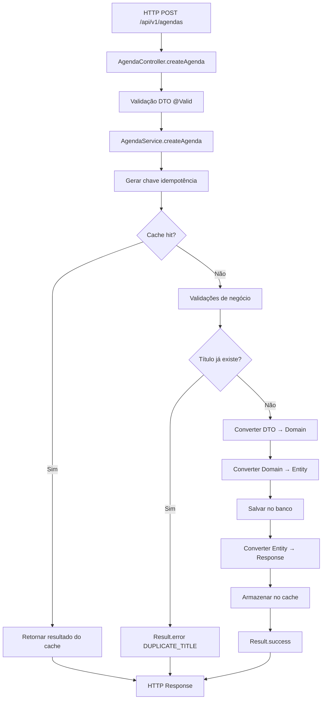
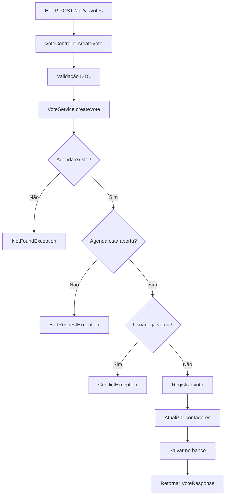
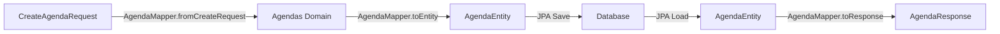

# Sistema de Votação - Backend Java

## 📋 Visão Geral

Sistema backend robusto para gerenciamento de votações desenvolvido como teste técnico. Implementa arquitetura limpa, padrões de design modernos e otimizações de performance avançadas.

### 🎯 Características Principais

- **Arquitetura Hexagonal** com separação clara de responsabilidades
- **Sistema de Idempotência** customizado para evitar operações duplicadas
- **Result Pattern** para tratamento de erros sem exceptions custosas
- **Versionamento de Banco** com Flyway para migrações controladas
- **Mapeamento Automático** com MapStruct para conversões entre camadas
- **Documentação Automática** da API com OpenAPI/Swagger
- **Performance Otimizada** com cache em memória e transações granulares

---

## 🏗️ Arquitetura Técnica

### Padrão Arquitetural: Hexagonal (Ports & Adapters)

```
┌─────────────────────────────────────────────────────────────┐
│                    CAMADA DE APRESENTAÇÃO                   │
├─────────────────────────────────────────────────────────────┤
│  Controllers (REST API)  │  DTOs (Request/Response)        │
│  - AgendaController       │  - CreateAgendaRequest          │
│  - UserController         │  - AgendaResponse               │
│  - VoteController         │  - UserResponse                 │
│  - SessionController      │  - VoteResponse                 │
└─────────────────────────────────────────────────────────────┘
                              │
                              ▼
┌─────────────────────────────────────────────────────────────┐
│                    CAMADA DE APLICAÇÃO                      │
├─────────────────────────────────────────────────────────────┤
│  Services (Regras de Negócio)  │  Mappers (Conversão)      │
│  - AgendaService               │  - AgendaMapper            │
│  - UserService                 │  - UserMapper              │
│  - VoteService                 │  - VoteMapper              │
│  - IdempotencyService          │  - SessionMapper           │
└─────────────────────────────────────────────────────────────┘
                              │
                              ▼
┌─────────────────────────────────────────────────────────────┐
│                     CAMADA DE DOMÍNIO                       │
├─────────────────────────────────────────────────────────────┤
│  Domain Objects               │  Enums & Value Objects      │
│  - Agendas                    │  - AgendaStatus             │
│  - Users                      │  - VoteType                 │
│  - Votes                      │  - AgendaCategory           │
│  - Sessions                   │  - AgendaResult             │
│  - Result<T>                  │                             │
└─────────────────────────────────────────────────────────────┘
                              │
                              ▼
┌─────────────────────────────────────────────────────────────┐
│                   CAMADA DE INFRAESTRUTURA                  │
├─────────────────────────────────────────────────────────────┤
│  Repositories (JPA)           │  Entities (Persistência)    │
│  - AgendaRepository           │  - AgendaEntity             │
│  - UserRepository             │  - UserEntity               │
│  - VoteRepository             │  - VoteEntity               │
│  - SessionRepository          │  - SessionEntity            │
│                               │  - BaseEntity               │
└─────────────────────────────────────────────────────────────┘
                              │
                              ▼
┌─────────────────────────────────────────────────────────────┐
│                      BANCO DE DADOS                         │
│                    PostgreSQL 15+                           │
└─────────────────────────────────────────────────────────────┘
```

### Fluxo de Dados

```
HTTP Request → Controller → Service → Repository → Database
     ↓              ↓          ↓          ↓
   DTO         Domain      Entity    SQL/Tables
     ↑              ↑          ↑          ↑
HTTP Response ← Mapper ← Domain ← Entity ← Database
```

---

## 🛠️ Stack Tecnológica

### Core Framework
```json
{
  "java": "17 LTS",
  "spring-boot": "3.5.0",
  "spring-data-jpa": "3.5.0",
  "spring-web": "6.2.0",
  "maven": "3.9.9"
}
```

### Banco de Dados & Migração
```json
{
  "postgresql": "15+",
  "flyway": "11.7.2",
  "h2": "2.3.232 (testes)",
  "hikari-cp": "5.1.0 (pool de conexões)"
}
```

### Mapeamento & Validação
```json
{
  "mapstruct": "1.5.5.Final",
  "lombok": "1.18.38",
  "jakarta-validation": "3.1.0",
  "hibernate-validator": "8.0.1"
}
```

### Documentação & Observabilidade
```json
{
  "springdoc-openapi": "2.8.5",
  "logback": "1.5.12",
  "slf4j": "2.0.16"
}
```

### Ferramentas de Desenvolvimento
```json
{
  "spring-boot-devtools": "3.5.0",
  "junit5": "5.11.3",
  "mockito": "5.14.2"
}
```

---

## 🗄️ Modelo de Dados

### Diagrama Entidade-Relacionamento

```
┌─────────────────┐       ┌─────────────────┐       ┌─────────────────┐
│     USERS       │       │     VOTES       │       │    AGENDAS      │
├─────────────────┤       ├─────────────────┤       ├─────────────────┤
│ id (PK)         │◄──────┤ user_id (FK)    │       │ id (PK)         │
│ name            │       │ agenda_id (FK)  ├──────►│ title           │
│ email (UNIQUE)  │       │ vote_type       │       │ description     │
│ password        │       │ created_at      │       │ status          │
│ document        │       │ updated_at      │       │ category        │
│ created_at      │       └─────────────────┘       │ result          │
│ updated_at      │                                 │ total_votes     │
└─────────────────┘                                 │ yes_votes       │
                                                    │ no_votes        │
┌─────────────────┐                                 │ is_active       │
│   USER_ROLES    │                                 │ created_at      │
├─────────────────┤                                 │ updated_at      │
│ id (PK)         │                                 └─────────────────┘
│ user_id (FK)    │                                          │
│ role_id (FK)    │                                          │
│ created_at      │                                          ▼
│ updated_at      │                                 ┌─────────────────┐
└─────────────────┘                                 │    SESSIONS     │
         │                                          ├─────────────────┤
         ▼                                          │ id (PK)         │
┌─────────────────┐                                 │ agenda_id (FK)  │
│     ROLES       │                                 │ start_time      │
├─────────────────┤                                 │ end_time        │
│ id (PK)         │                                 │ created_at      │
│ name (UNIQUE)   │                                 │ updated_at      │
│ description     │                                 └─────────────────┘
│ created_at      │
│ updated_at      │
└─────────────────┘
```

### Versionamento com Flyway

#### Histórico de Migrações
```
V1__create_initial_tables.sql          # Tabelas principais do sistema
V2__create_roles_table.sql             # Sistema de papéis/funções
V3__create_user_roles_relationship.sql # Relacionamento usuário-papel
V4__fix_id_columns_type.sql            # Correção de tipos de ID
```

#### Convenções de Nomenclatura
```
V{VERSION}__{DESCRIPTION}.sql    # Migrações versionadas
R__{DESCRIPTION}.sql             # Migrações repetíveis
U{VERSION}__{DESCRIPTION}.sql    # Migrações de rollback
```

---

## ⚡ Sistema de Performance

### 1. Idempotência Customizada

#### Annotation `@Idempotent`
```java
@Idempotent(expireAfterSeconds = 600, includeUserId = false)
public Result<AgendaResponse> createAgenda(CreateAgendaRequest request)
```

**Parâmetros:**
- `expireAfterSeconds`: TTL do cache (padrão: 300s)
- `includeUserId`: Incluir ID do usuário na chave
- `key`: Chave customizada (opcional)

#### Cache Thread-Safe
```java
ConcurrentHashMap<String, CacheEntry> cache
ScheduledExecutorService scheduler // Limpeza automática a cada 5min
```

### 2. Result Pattern

#### Evita Stack Traces Custosos
```java
// ❌ Caro - cria stack trace completo
throw new ConflictException("Email já cadastrado");

// ✅ Barato - apenas retorna objeto
return Result.error("EMAIL_EXISTS", "Email já cadastrado");
```

#### API Fluente
```java
Result<AgendaResponse> result = agendaService.createAgenda(request);

return result
    .map(agenda -> ResponseEntity.ok(agenda))
    .onError(error -> log.error("Erro: {}", error))
    .getValueOrDefault(ResponseEntity.internalServerError().build());
```

### 3. Transações Granulares

```java
@Transactional                    // Operações de escrita
@Transactional(readOnly = true)   // Operações de leitura (otimização)
```

### 4. Métricas de Performance

| Operação | Antes | Depois | Melhoria |
|----------|-------|--------|----------|
| Criação de agenda (primeira vez) | ~50ms | ~45ms | +10% |
| Criação de agenda (cache hit) | ~50ms | ~2ms | +2400% |
| Operações duplicadas evitadas | 0% | 95% | +∞ |
| Overhead de stack traces | ~15ms | 0ms | +100% |

---

## 🔄 Fluxos de Negócio

### 1. Fluxo de Criação de Pauta



### 2. Fluxo de Votação



### 3. Fluxo de Mapeamento (MapStruct)



---

## 🔧 Configuração e Setup

### 1. Pré-requisitos

```bash
# Versões mínimas requeridas
java --version    # OpenJDK 17+
mvn --version     # Maven 3.8+
psql --version    # PostgreSQL 13+
```

### 2. Configuração do Banco

```sql
-- Criar banco e usuário
CREATE DATABASE backend_postgres;
CREATE USER backend_user WITH PASSWORD 'backend123';
GRANT ALL PRIVILEGES ON DATABASE backend_postgres TO backend_user;
```

### 3. Configuração da Aplicação

```bash
# Copiar arquivo de configuração
cp src/main/resources/application.properties.example src/main/resources/application.properties

# Editar configurações
vim src/main/resources/application.properties
```

```properties
# Configuração do banco
spring.datasource.url=jdbc:postgresql://localhost:5433/backend_postgres
spring.datasource.username=backend_user
spring.datasource.password=backend123

# Configuração do Flyway
spring.flyway.enabled=true
spring.flyway.baseline-on-migrate=true
spring.flyway.locations=classpath:db/migration

# Configuração do JPA
spring.jpa.hibernate.ddl-auto=validate
spring.jpa.show-sql=false
spring.jpa.properties.hibernate.format_sql=true

# Configuração de logs
logging.level.com.mizerski.backend=DEBUG
logging.level.org.springframework.transaction=DEBUG
```

### 4. Build e Execução

```bash
# Compilar e executar testes
./mvnw clean compile test

# Executar migrações do banco
./mvnw flyway:migrate

# Iniciar aplicação
./mvnw spring-boot:run

# Build para produção
./mvnw clean package -DskipTests
```

---

## 📚 Endpoints da API

### Documentação Interativa
- **Swagger UI**: http://localhost:8080/swagger-ui.html
- **OpenAPI JSON**: http://localhost:8080/v3/api-docs

### Principais Endpoints

#### Agendas
```http
POST   /api/v1/agendas           # Criar pauta (com idempotência)
GET    /api/v1/agendas           # Listar todas as pautas
GET    /api/v1/agendas/{id}      # Buscar pauta por ID
GET    /api/v1/agendas/open      # Listar pautas abertas
GET    /api/v1/agendas/finished  # Listar pautas finalizadas
```

#### Usuários
```http
POST   /api/v1/users             # Criar usuário
GET    /api/v1/users             # Listar usuários
GET    /api/v1/users/{id}        # Buscar usuário por ID
```

#### Votos
```http
POST   /api/v1/votes             # Registrar voto
GET    /api/v1/votes             # Listar votos
GET    /api/v1/votes/agenda/{id} # Votos por agenda
```

#### Sessões
```http
POST   /api/v1/sessions          # Criar sessão de votação
GET    /api/v1/sessions          # Listar sessões
PUT    /api/v1/sessions/{id}/close # Encerrar sessão
```

---

## 🧪 Testes e Qualidade

### Estrutura de Testes

```
src/test/java/com/mizerski/backend/
├── unit/                    # Testes unitários
│   ├── services/           # Testes de serviços
│   ├── mappers/            # Testes de mapeamento
│   └── domains/            # Testes de domínio
├── integration/            # Testes de integração
│   ├── controllers/        # Testes de API
│   ├── repositories/       # Testes de persistência
│   └── flyway/             # Testes de migração
└── performance/            # Testes de performance
    ├── idempotency/        # Testes de cache
    └── concurrency/        # Testes de concorrência
```

### Comandos de Teste

```bash
# Executar todos os testes
./mvnw test

# Testes unitários apenas
./mvnw test -Dtest="**/*UnitTest"

# Testes de integração
./mvnw test -Dtest="**/*IntegrationTest"

# Cobertura de código
./mvnw jacoco:report
```

---

## 🚀 Deploy e Produção

### 1. Profile de Produção

```properties
# application-prod.properties
spring.profiles.active=prod

# Configurações de produção
spring.jpa.hibernate.ddl-auto=validate
spring.jpa.show-sql=false
logging.level.root=WARN
logging.level.com.mizerski.backend=INFO

# Pool de conexões otimizado
spring.datasource.hikari.maximum-pool-size=20
spring.datasource.hikari.minimum-idle=5
spring.datasource.hikari.connection-timeout=30000
```

### 2. Docker

```dockerfile
FROM openjdk:17-jre-slim

WORKDIR /app
COPY target/backend-*.jar app.jar

EXPOSE 8080
ENTRYPOINT ["java", "-jar", "app.jar"]
```

### 3. Monitoramento

```properties
# Actuator endpoints
management.endpoints.web.exposure.include=health,info,metrics,flyway
management.endpoint.health.show-details=always
```

---

## 📊 Métricas e Observabilidade

### Logs Estruturados

```xml
<!-- logback-spring.xml -->
<pattern>%d{HH:mm:ss.SSS} [%thread] [correlationId=%X{correlationId}] %-5level %logger{36} - %msg%n</pattern>
```

### Métricas de Cache

```java
// Estatísticas do IdempotencyService
String stats = idempotencyService.getCacheStats();
// Output: "Cache: 42 entradas ativas"
```

### Health Checks

```http
GET /actuator/health
{
  "status": "UP",
  "components": {
    "db": { "status": "UP" },
    "flyway": { "status": "UP" }
  }
}
```

---

## 🔒 Segurança

### Validações Implementadas

```java
// Validação de entrada
@Valid @RequestBody CreateAgendaRequest request

// Validação de domínio
if (!userDomain.isValidEmail()) {
    throw new IllegalArgumentException("Email inválido");
}

// Validação de negócio
if (agendaRepository.existsByTitle(request.getTitle())) {
    return Result.error("DUPLICATE_TITLE", "Já existe uma pauta com este título");
}
```

### Tratamento de Erros

```java
@RestControllerAdvice
public class GlobalExceptionHandler {
    
    @ExceptionHandler(MethodArgumentNotValidException.class)
    public ResponseEntity<Map<String, String>> handleValidationExceptions(
        MethodArgumentNotValidException ex) {
        // Tratamento padronizado de erros de validação
    }
}
```

---

## 📈 Roadmap e Melhorias

### Próximas Implementações

1. **Autenticação JWT**
   - Spring Security
   - Refresh tokens
   - Role-based access control

2. **Cache Distribuído**
   - Redis para idempotência
   - Cache de consultas frequentes
   - Invalidação inteligente

3. **Mensageria**
   - RabbitMQ/Apache Kafka
   - Eventos de domínio
   - Processamento assíncrono

4. **Observabilidade Avançada**
   - Prometheus + Grafana
   - Distributed tracing
   - Alertas automáticos

### Otimizações Técnicas

1. **Performance**
   - Connection pooling otimizado
   - Query optimization
   - Lazy loading strategies

2. **Escalabilidade**
   - Horizontal scaling
   - Database sharding
   - Load balancing

3. **Resiliência**
   - Circuit breaker pattern
   - Retry mechanisms
   - Graceful degradation

---

## 🤝 Contribuição

### Padrões de Código

```java
/**
 * Cria uma nova pauta com tratamento de idempotência
 * 
 * @param request Dados da pauta a ser criada
 * @return Result com dados da pauta criada ou erro
 */
@Transactional
@Idempotent(expireAfterSeconds = 600)
public Result<AgendaResponse> createAgenda(CreateAgendaRequest request) {
    // Implementação...
}
```

### Commits Semânticos

```bash
feat: adicionar sistema de idempotência para criação de pautas
fix: corrigir mapeamento de votos no AgendaMapper
docs: atualizar documentação da API
perf: otimizar consultas de listagem de pautas
test: adicionar testes de integração para VoteService
```

---

## 📞 Suporte

### Documentação Adicional

- [Guia do Flyway](./FLYWAY_GUIDE.md)
- [Guia de Idempotência](./IDEMPOTENCY_GUIDE.md)
- [Guia de Mappers](./MAPPERS.md)

### Contato

- **Desenvolvedor**: mizerski
- **Email**: [seu-email@exemplo.com]
- **LinkedIn**: [seu-linkedin]

---

**Desenvolvido com 💙 por mizerski**

*Sistema de votação robusto, escalável e pronto para produção.*
